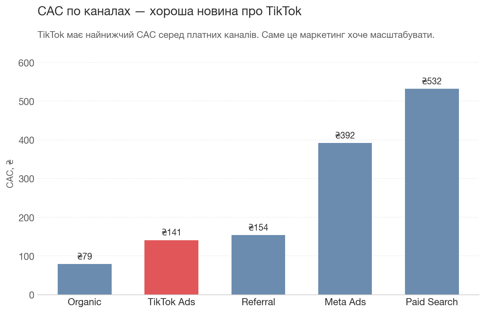
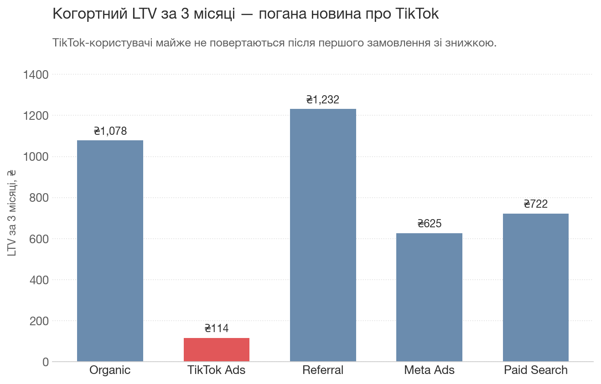
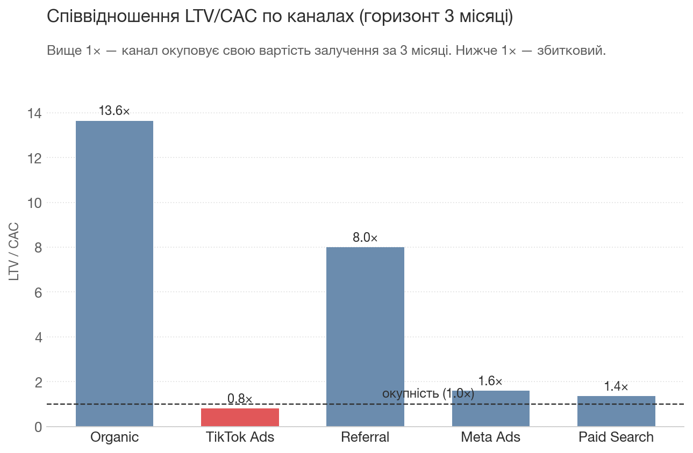
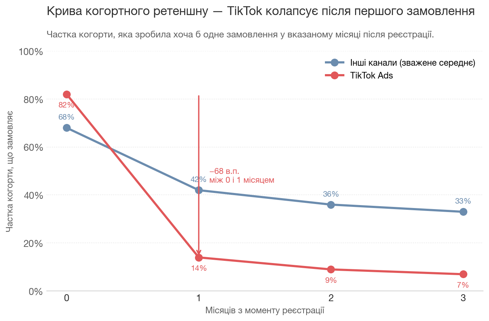
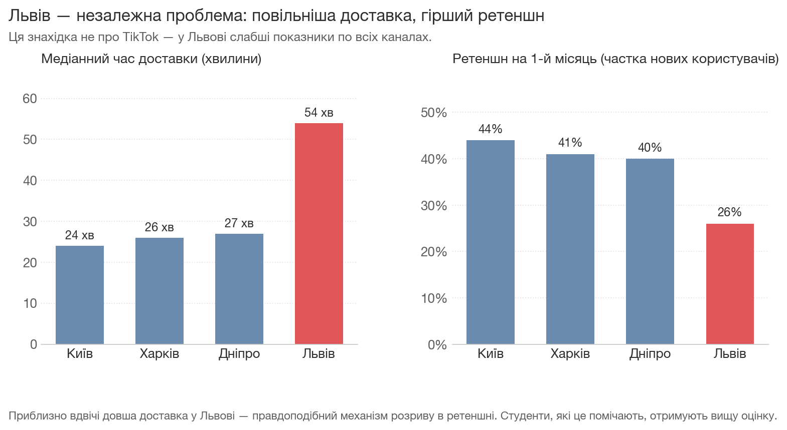

# Завдання 1

Припущення, з яких я виходжу в процесі підготовки завдання:

- Теоретичний блок пояснює LTV, CAC, маржу, когортний аналіз.
- Студенти вже пройшли блок з аналітичним інструментом і мають достатній рівень, щоб технічна сторона аналізу не була для них чимось новим. Якщо говоримо про Tableau — то це вміння працювати з кількома табличками через Relations, будувати Custom Calculations і певний рівень LOD-функцій.

## Легенда

Ви продакт-аналітик українського стартапу з доставки їжі, що працює в кількох містах: Київ, Дніпро, Львів, Харків.

Три місяці тому команда маркетингу запустила новий канал залучення користувачів через TikTok Ads. Початкові результати багатообіцяючі: TikTok має найнижчий CAC серед усіх основних каналів залучення. Маркетинг хоче перерозподілити бюджет та масштабувати цей канал до 30% маркетингового бюджету.

CFO не впевнений у цій ідеї і звертається до вас із наступним питанням:

> Низький CAC — це круто, але чи маємо ми розуміння, наскільки профітабельні ці клієнти? Чи можемо ми бути впевнені, що скейлінг призведе до підйому ревенью? Покопайся в даних і допоможи визначитись, чи варто скейлити TikTok-рекламу.

## Дані

Три таблички з інформацією:

- `users` — кожен рядок у табличці — інформація про зареєстрованого користувача. Стовпці:
    - user_id
    - signup_date
    - city
    - acquisition_channel
    - platform (android / ios)

- `orders` — кожен рядок у табличці — інформація про доставлене замовлення. Для зручності всі дані з таблички `users` підтягнуті до цієї таблички; втім, у табличці `users` міститься також інформація про користувачів, що не створили жодного замовлення. Стовпці:
    - order_id
    - user_id
    - order_date
    - signup_date
    - city
    - acquisition_channel
    - platform
    - order_value_uah (скільки заплатив користувач за замовлення)
    - food_cost_uah (скільки ми заплатили ресторану)
    - delivery_cost_uah (скільки ми заплатили кур'єру)
    - delivery_time_min (час, що пройшов від створення замовлення до підтвердження клієнтом про отримання)
    - discount_applied (0..1 — відсоток знижки, застосований до ціни замовлення. 0 = немає знижки)

- `channel_spend` — табличка з тижневим зведенням витрат у рекламних системах, розділених по місту (кампанії таргетовані по кожному місту окремо). Стовпці:
    - week_start — дата початку тижня
    - channel — маркетинговий канал
    - city
    - spend_uah

Період: жовтень 2025 — березень 2026.
Канали: Organic, Paid Search, Meta Ads, Referral, TikTok Ads.

## Що потрібно здати

Результат завдання — коротка презентація (6–10 слайдів у Google Slides або аналогічному форматі), що містить:

- Короткий висновок із вердиктом щодо TikTok та рекомендацією для CFO.
- Візуалізацію даних, що підтверджує знахідку.
- Пояснення механізму: не просто що саме було знайдено, а яким чином користувачі з TikTok поводять себе саме тим чи іншим чином.

Разом із презентацією необхідно надати артефакт, що містить процес вашого аналізу даних: Excel, Tableau чи інший інструмент, яким ви аналізували вхідні дані. Файл має бути зданий у форматі, який передбачає, що у перевіряючого буде можливість успішно відкрити та прослідкувати хід ваших дій.

## Як підійти до виконання

Питання від CFO доволі вузьке, але щоб на нього відповісти, скоріш за все доведеться пройти кілька циклів аналізу. Загальний цикл наступний:

Обрати/розрахувати цільову метрику → переглянути її динаміку в часі → переглянути її розбивку по когортах чи сегментах → якщо щось виглядає незвично чи вирізняється від решти, спробувати пояснити цю поведінку іншими метриками чи додатковими розбивками → сформувати рекомендації.

Залежно від того, чи коректні метрики ви оберете з першого разу, можливо, цей цикл доведеться повторити декілька разів.

Протягом аналізу даних ви можете помітити речі, про які CFO не просив явно, але які також варті уваги. Якщо незалежно від історії з TikTok щось виглядає достатньо цікавим, включіть це у ваш аналіз та презентацію.

# Завдання 1 — Критерії оцінювання (для менторів)

Основна знахідка, яку це завдання очікує від тих, хто виконує завдання — TikTok Ads це канал, що ховає низьку профітабельність за дешевим CAC.

- TikTok Ads CAC низький порівняно із загальним значенням для інших каналів.
- TikTok-юзери «спалюють» знижки на перше замовлення, але мінімальна кількість замовляє більше ніж один раз — 10% проти 40% по решті каналів.
- Когортний LTV за 3 місяці менший за CAC — отже, навіть привабливий CAC не компенсує збитків.
- Збільшення частки бюджету до 30% потягне загальний LTV/CAC нижче за 1.

Протягом аналізу можлива інша знахідка: Львів має проблеми операційного характеру, що є незалежною від TikTok проблемою.

- Середній час доставки у Львові значно вищий за інші міста.
- Ретеншн нових юзерів занижений по всіх каналах, не лише TikTok.

Це не обов'язкова знахідка, але вирізняє студентів, які достатньо глибоко занурились у юніт-економіку та вийшли за рамки очікуваного.

## Чек-ліст хорошої роботи

- LTV порахований на основі профіту (відмінусовані кости за доставку та оплата ресторану).
- LTV для всіх каналів порахований на рівні 3 місяців (оскільки TikTok запустився лише 3 місяці тому, порівняння з іншими каналами має також відбуватись на рівних умовах).
- Презентація містить наглядне порівняння CAC та LTV по каналах.
- Проаналізована крива ретеншну або порахований відсоток користувачів, які зробили більше ніж одне замовлення.
- Коректно пояснений механізм поведінки: TikTok-користувачі активно замовляють перші замовлення зі знижкою по купону, але майже не роблять наступне замовлення без знижки.
- Рекомендацією є постановка TikTok-реклами на паузу або обмеження бюджету на неї. Рекомендований перегляд стратегії знижок за перше замовлення: можливо, канал можна зробити більш окупним, не пропонуючи знижки, і таким чином менше оптимізувати рекламні кампанії виключно під CAC.

Найбільш якісно підготовлений аналіз буде також містити знахідку про проблематичність операційки у Львові, якщо студент вирішить провести аналіз метрик LTV чи ретеншну між містами. Буде помітно, що Львів має занижені значення цих метрик, але це причина, не пов'язана з TikTok — у такому випадку презентація може містити відсилку на це. Ідеальний фреймінг — це окремий слайд-два «ось що я помітив додатково», воно не має відтягувати увагу від основної теми — аналізу TikTok-реклами.

## Типові помилки

- LTV розрахований на основі `order_value_uah`, а не маржі після віднімання `delivery_cost_uah` та `food_cost_uah`.
- LTV розрахований без часових рамок — якісь канали запустились раніше і мають вищий LTV, тож порівняння з TikTok буде некоректне.
- Відсутність пояснення до наданих рекомендацій або надто загальні рекомендації. «LTV TikTok низький, рекомендовано стопнути канал» може бути занадто сильною рекомендацією, враховуючи, що канал успішний у певних метриках — набрана клієнтська база може бути реактивована в майбутньому.
- Рекомендації не спонукають до дії.
- Проблема зі Львовом подана як пояснення проблеми з TikTok — може статися, якщо студент знайшов проблему, але не провів крос-перевірку.
- Рекомендації містять поради, що не засновані на даних; або припущення видаються за інсайти («TikTok-юзери загалом мають меншу купівельну спроможність» — це не інсайт, це припущення, перевірити яке у нас немає даних).

## Критерії затвердження/відхилення

Завдання вважається успішним, якщо всі критерії нижче виконані:

- Метрики, на основі яких виноситься рішення, стосуються юніт-економіки (LTV, CAC, Retention), а не є накопичувальними (Total Revenue, Total Orders).
- LTV порахований на основі маржі, а не суми замовлень.
- LTV порівнюється між каналами з урахуванням їх специфіки (або обраний Capped LTV, або порівняння ведеться в рамках часового періоду, протягом якого була активна реклама в TikTok).
- Ідентифікована різниця в ретеншні.
- Пояснений механізм за допомогою інших метрик (завищений відсоток замовлень зі знижкою або низький відсоток 2+ замовлень).
- Наявні рекомендації, засновані на знахідках та інсайтах у даних.

Завдання повертається на доопрацювання, якщо виконується хоча б один з критеріїв:

- LTV розрахований на основі виручки (`order_value_uah`), а не маржі.
- LTV поданий без зазначеного часового горизонту, або канали порівнюються на нерівних горизонтах.
- LTV TikTok поданий без порівняння з іншими каналами як бенчмарком.
- Відсутній будь-який погляд на ретеншн — лише одне агрегатне число LTV.
- Аналіз зупиняється на констатації «LTV TikTok низький» без пояснення механізму.
- Рекомендації занадто загальні («моніторити», «покращити ретеншн»), без конкретних дій.
- Львів поданий як причина проблеми з TikTok (незалежний фактор переплутано з основним сюжетом).

Бонус-поінти надаються за додаткову знахідку з операційними проблемами у Львові та надані рекомендації щодо виправлення ситуації.

Візуалізації, які можуть надати студенти для пояснення:

---

# Завдання 2 — Відео про Correlation vs Causation

